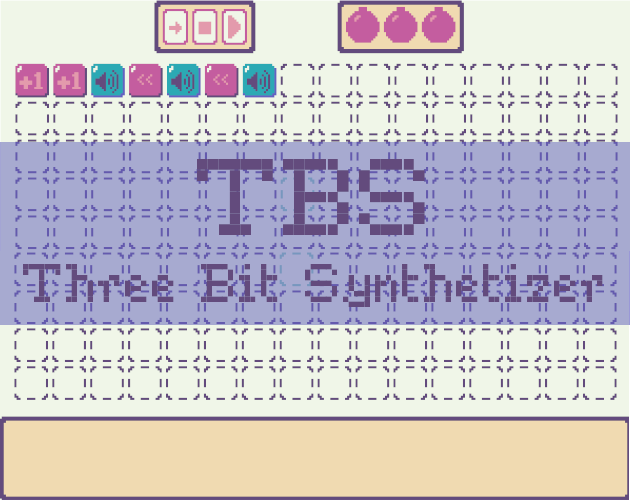

# TBS: Three Bits Synthetizer
Created in **3H (almosts)** for the [Trijam 256](https://itch.io/jam/trijam-256) by **Bigaston**

In TBS, you create some music with boolean operation. You have access to a shared 3 bits memory, that you can increase, decrease or rotate, and each of the 8 possible values make a different sound effect!

Available on [itch.io](https://bigaston.itch.io/tbs)

## Resource Used
- Passage by SomePX: https://somepx.itch.io/pixel-font-passage
- FAIRYDUST 8 PALETTE: https://lospec.com/palette-list/fairydust-8
- Sound Effects: [Chipdrum from Shiru](https://shiru.untergrund.net/software.shtml)